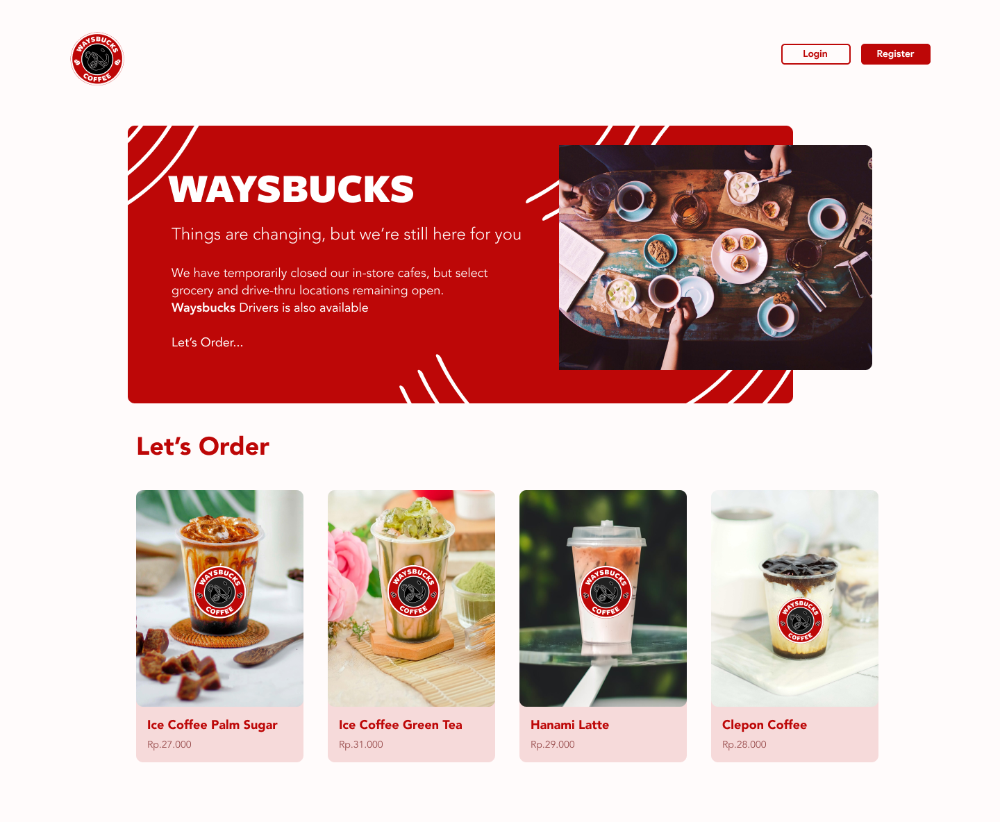

# WAYSBUCK APP

Waysbuck app is web app that you can order beverage

## Feature
- [x] Login and Register
- [x] Authectication
- [x] Change profile
- [x] Administrator management
- [x] Delivery management
- [x] Product management
- [x] Order
- [x] Order status
- [x] Bill and Payment
- [x] Transaction history
- [x] Rate and complaint
- [x] Error, empty and unauthorized page handling

### Stacks
- React.Js
- React Context
- React Bootstrap
- Express Js
- Mysql
- Sequelize Js


### Dependencies
- React Router Dom
- Axios
- Multer
- Json Webtoken
- Bcrypt
- Concurrently
- Cors
- Dotenv
- Joi
- Multer
- Nodemon
- Cloudinary

Clone the repository :

```
git clone https://github.com/Rino-Saputra/Waysbuck-app
```

Switch to the repo folder :

```
cd Waysbuck-app/client
```

Install all the dependencies using `npm` or you can using `yarn` :

```
npm install or yarn install
```

```
cd ../server
```

Install all the dependencies using `npm` or you can using `yarn` :

```
npm install or yarn install
```

install xampp/mampp/lampp depend on computer Os

click start apache and mysql

open directory work on code editor terminal

```
npx sequelize-cli db:migrate
```

Run the server :

```
npm run dev
```

get access the server at http://localhost:3000

## [DEMO](https://waysbuck-rino.netlify.app/)

- 